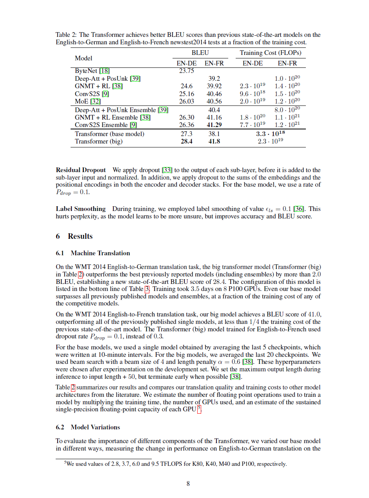
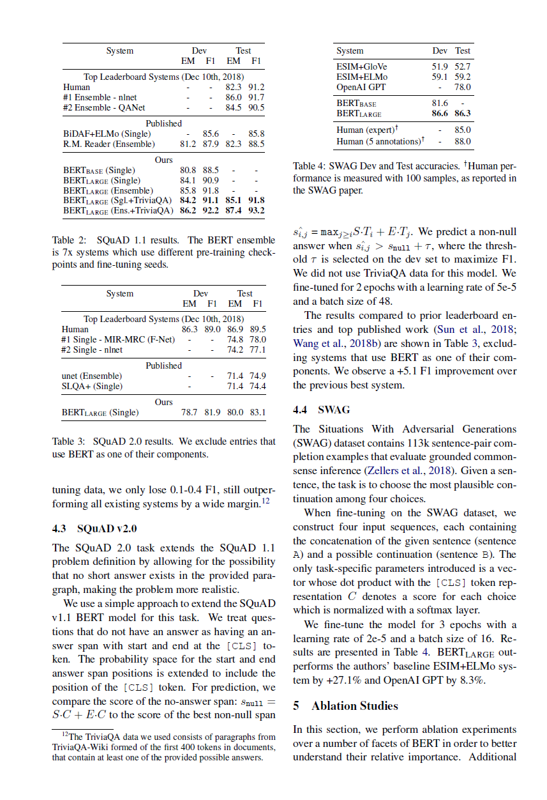
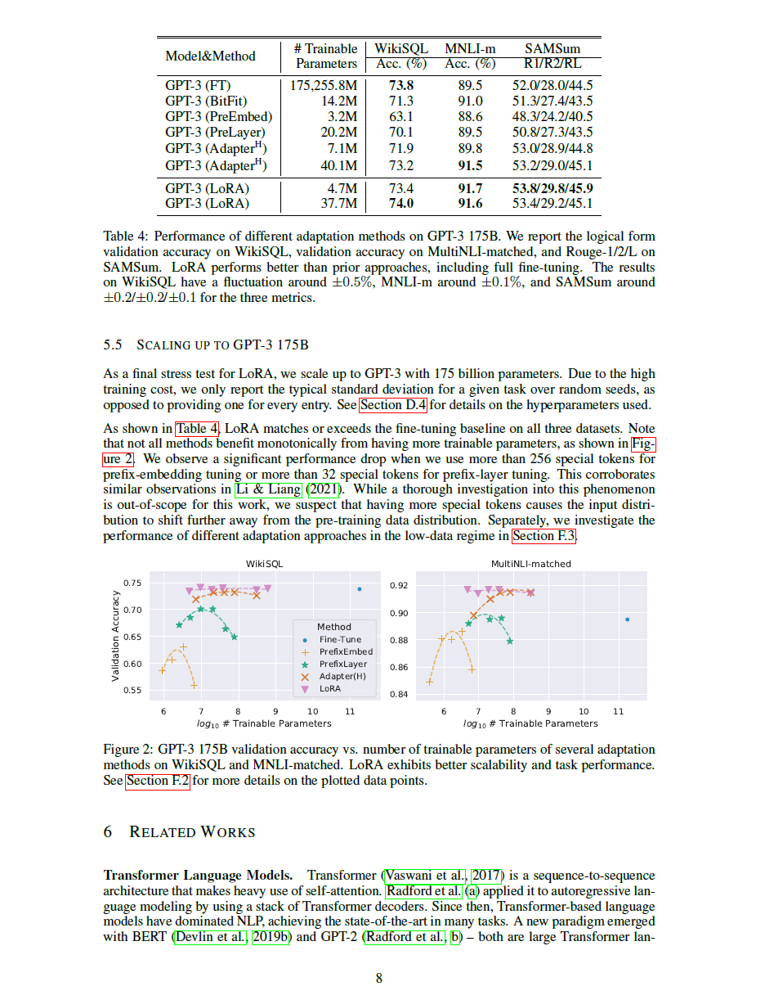

# PDF 文本解析问题与设计分析

观察日期：2026-10-03

## 1. 文档定位

本文件记录 PaperTrace 在处理英文计算机论文 PDF 时发现的典型文本解析问题，并分析这些问题对文本清洗、分块、检索和证据定位设计的影响。

文档用于为后续技术方案提供可复核的实验依据，同时说明当前解析能力的适用范围和已知限制。所有结论均来自样本论文的实际解析结果及其与原始版面的对照分析。

## 2. 样本与分析范围

分析使用以下三篇英文计算机论文作为首批样本：

| 论文 | JSON 页数 | 抽查页 |
| --- | ---: | --- |
| Attention Is All You Need | 15 | 1、4、8、15 |
| BERT: Pre-training of Deep Bidirectional Transformers for Language Understanding | 16 | 1、5、7、16 |
| LoRA: Low-Rank Adaptation of Large Language Models | 26 | 1、5、8、26 |

每篇样本均覆盖首页、方法或模型页、实验结果页和末页。分析依据包括：

1. 页级 JSON 中的解析文本。
2. 行数、短行、行末连字符和空行等统计特征。
3. 使用人工截取的页面图像与提取结果进行比对。

## 3. 总体观察

### 3.1 页码对应关系正确

三篇论文的 JSON 页码与 PDF 页码一致。正文、章节标题、表格标题和图注通常都能在对应页中找到。

这说明 v0.1 的页级定位可以继续作为证据追踪的基础。

### 3.2 原始段落边界基本丢失

抽查页的提取文本几乎没有空行。视觉上独立的标题、段落、图注、脚注和表格，在 JSON 中主要依赖换行分隔。

影响：不能简单地用空行作为唯一段落切分依据。后续分块需要结合句子结束符、标题规则、长度限制和版面特征。

### 3.3 双栏正文大体可读，但行被版面换行切碎

BERT 和 LoRA 使用双栏排版。pypdf 通常先提取左栏，再提取右栏，整体阅读顺序大体合理，但每个视觉行都可能成为一个文本行。

例如 BERT 首页的摘要中出现：

```text
We introduce a new language representa-
tion model called BERT
```

视觉排版造成的断行和断词不能直接视为句子或段落边界。

### 3.4 行末连字符断词较多

BERT 的抽查页尤其明显：

| 页面 | 行末连字符数量 |
| --- | ---: |
| BERT 第 1 页 | 26 |
| BERT 第 5 页 | 25 |
| BERT 第 7 页 | 24 |
| BERT 第 16 页 | 9 |

LoRA 首页也有 13 个行末连字符。它们大多来自排版断词，例如 `representa-` 与下一行的 `tion`。

但不能无条件删除所有行末连字符，因为英文中存在真实连字符词，如 `state-of-the-art`、`fine-tuning`、`low-rank`。后续需要根据“行末连字符 + 下一行小写开头”等条件谨慎合并，并保留未能确定的情况。

### 3.5 页眉、页脚和元数据混入正文

观察到以下噪声：

1. 页面末尾的独立页码，例如 `4`、`8`、`15`。
2. arXiv 版本和日期，例如 `arXiv:1810.04805v2 [cs.CL] 24 May 2019`。
3. 会议名称和版权说明。
4. 作者脚注与脚注编号。

这些内容不应直接全部删除。页码可作为高置信度噪声处理；arXiv 信息、会议名和脚注可能属于论文元数据，需要与正文内容分开保存或在检索时降权。

### 3.6 表格可以提取内容，但结构被线性化

Transformer 第 8 页、BERT 第 7 页和 LoRA 第 8 页的实验表格都提取出了模型名、指标和数字，但列结构主要依赖空格和换行：

```text
Model&Method # Trainable WikiSQL MNLI-m SAMSum
Parameters Acc. (%) Acc. (%) R1/R2/RL
GPT-3 (FT) 175,255.8M 73.8 89.5 52.0/28.0/44.5
```

影响：页级全文检索仍可使用这些文本，但不能假设普通文本分块能够恢复表格的行列关系。表格结构恢复应作为后续独立能力，不属于基础清洗器的职责。

### 3.7 图形页会生成大量短 token 和坐标文字

Transformer 第 15 页和 LoRA 第 26 页主要是可视化图形。提取结果包含大量单词、数字、坐标轴刻度和标签：

```text
0.0
0.1
0.2
...
Layer 1
Wq
Wv
```

Transformer 第 15 页有 114 行，其中 111 行不超过 40 个字符；LoRA 第 26 页有 147 行，其中 128 行不超过 40 个字符。

如果直接按行或短段落分块，会产生大量低质量 chunk。后续需要识别“图形密集页”或连续短行区域，优先保留图注，降低坐标和标签碎片的影响。

### 3.8 数学公式被近似线性化

公式中的上下标、根号、矩阵维度和特殊字符通常能够提取一部分，但其线性顺序和 Unicode 字符可能不稳定。

例如 Transformer 的注意力公式可以提取出变量和部分运算符，但不能依赖当前结果完整恢复视觉公式。

基础清洗阶段应保留公式字符，不尝试自动改写或纠正公式。

### 3.9 跨页句子会被截断

观察到多处明确的跨页延续：

1. Transformer 第 4 页结尾停在 `yielding dv-dimensional`，句子在下一页继续。
2. BERT 第 16 页开头是 `jority class.`，明显承接前一页的 `majority class`。
3. LoRA 第 5 页开头是 `guarantees that we do not introduce...`，承接前一页的句子。

因此，如果坚持 chunk 不跨页，必须接受少量句子被截断；也可以在后续设计中保存相邻页引用或有限的跨页 overlap，但不能丢失原始页码归属。

### 3.10 章节标题较容易通过规则识别

三篇论文中出现了较稳定的章节标题形式：

```text
Abstract
1 Introduction
3.2.1 Scaled Dot-Product Attention
4 Experiments
4.1 GLUE
5 Ablation Studies
C Additional Ablation Studies
C.1 Effect of Number of Training Steps
6 Related Works
```

章节编号可能是数字、多级数字或附录字母；标题大小写也不统一。第一版可以使用正则和关键词映射识别，不需要立即训练分类模型。

## 4. 分论文观察

### 4.1 Attention Is All You Need

第 1 页：标题、作者、Abstract、作者脚注、会议名称和 arXiv 元数据均被提取。作者与单位形成大量短行。

第 4 页：图标题、章节标题和正文顺序基本正确；公式与脚注被线性化；页面末尾存在独立页码；最后一句跨页截断。

第 8 页：实验表格、Residual Dropout、Label Smoothing、Results 和 Machine Translation 均可检索；表格列结构丢失；脚注和页码混入正文。

第 15 页：注意力可视化导致大量单词级短行；图注提取正常。该页不适合按普通段落规则直接分块。

### 4.2 BERT

第 1 页：双栏顺序大体正确；摘要和 Introduction 可以识别；行末断词非常密集；arXiv 边栏文字被放到页尾。

第 5 页：模型输入图中的 token、embedding 标签和正文混合；Pre-training data、Fine-tuning BERT、Experiments 和 GLUE 等标题可识别；正文存在大量排版断词。

第 7 页：多个 SQuAD 和 SWAG 表格被线性化；左右栏内容仍基本按阅读顺序输出；Ablation Studies 标题可识别。

第 16 页：页面开头承接上一页残句；附录章节标题清晰；图表、问题列表与正文混合，但主要语义仍可读。

### 4.3 LoRA

第 1 页：论文标题中的小型大写导致 `LORA: L OW-RANK...` 等异常空格；作者、邮箱、版本信息、Abstract 和 Introduction 均被提取；有较多行末断词。

第 5 页：页面开头承接上一页；Applying LoRA to Transformer、Practical Benefits and Limitations、Empirical Experiments、Baselines 等标题清晰；公式变量和脚注混入正文。

第 8 页：实验表格内容可检索但列结构丢失；图表坐标文字与图注混合；Related Works 标题可识别。

第 26 页：热力图和坐标产生大量数字与短 token；表格正文可提取；图注较完整。普通按行切分会生成大量噪声块。

## 5. 代表性可视化对照案例

以下案例将 PDF 的实际版面与页级文本提取结果进行对照，用于说明解析问题如何影响后续系统设计。图片只截取与问题相关的局部区域，不代表对整篇论文进行图像识别。

### 5.1 Transformer 第 8 页：表格结构被线性化



原始页面中，BLEU 和 Training Cost（FLOPs）分别对应多列数据，表格的行列关系通过视觉布局表达。页级提取结果则表现为连续文本：

```text
Model
BLEU Training Cost (FLOPs)
EN-DE EN-FR EN-DE EN-FR
ByteNet [18] 23.75
...
Transformer (big) 28.4 41.8 2.3 · 10^19
```

这说明当前解析结果适合用于关键词检索和证据页定位，但不能直接当作结构化表格使用。后续如果需要准确回答“某模型在某数据集上的指标”，需要额外的表格结构恢复或人工校验机制。

### 5.2 BERT 第 7 页：双栏排版与实验表格混合



该页面同时包含 SQuAD 表格、SWAG 表格和双栏正文。提取文本能够保留模型名、数据集、EM、F1 等关键信息，但表格列关系被展开，正文、公式和章节标题也按线性顺序混合在一起。

例如提取结果中会出现：

```text
System Dev Test
EM F1 EM F1
BERTLARGE (Single) 80.8 88.5 - -
...
4.4 SWAG
The Situations With Adversarial Generations (SWAG) dataset...
```

因此，后续文本块需要保留页码、章节标题和原始文本，同时不能假设一个普通 chunk 已经包含完整的表格语义。

### 5.3 LoRA 第 8 页：实验表格、图形和正文同时出现



该页面包含 GPT-3 适配方法对比表格、Figure 2 和 Related Works 正文。提取结果可以找到方法名、可训练参数数量、WikiSQL 和 MNLI-m 指标，但图形坐标、图例和正文也会进入同一页的线性文本。

典型提取片段如下：

```text
Model&Method # Trainable WikiSQL MNLI-m SAMSum
Parameters Acc. (%) Acc. (%) R1/R2/RL
GPT-3 (LoRA) 4.7M 73.4 91.7 53.8/29.8/45.9
...
Figure 2: GPT-3 175B validation accuracy...
6 RELATED WORKS
```

如果直接按行或固定长度分块，表格数值、图形标签和正文可能被切到同一个 chunk 中。后续分块需要识别表格和图注边界，并为证据保留页码和文本来源。

## 6. 对文本清洗设计的约束

根据上述问题，基础清洗器可以安全考虑：

1. 统一换行符。
2. 删除空字符和不可见控制字符。
3. 清理每行首尾空白。
4. 压缩行内重复空格，但谨慎处理表格区域。
5. 识别独立页码行。
6. 对高置信度排版断词进行合并。
7. 保留清洗前文本，保证证据可回溯。

基础清洗器不应直接承担以下任务：

1. 删除所有短行。
2. 删除所有数字或符号。
3. 无条件删除所有行末连字符。
4. 尝试重建复杂表格。
5. 自动改写数学公式。
6. 把图形标签当作普通段落大量生成 chunk。
7. 因为文本跨页而改变原始页码归属。

## 7. 对分块方案的设计约束

以下内容是基于样本分析形成的设计约束，不代表相关功能已经实现。

1. 不能只依赖空行识别段落，因为当前提取结果几乎没有空行。
2. 应优先利用章节标题、句子结束符和长度阈值。
3. 第一版 chunk 应保存原始页码、块序号、章节标题和清洗前文本引用。
4. 图形密集页和表格密集页需要标记，避免按普通正文策略切成大量碎片。
5. 对跨页句子，可保留有限相邻上下文，但需要明确区分主要页码与关联页码。

## 8. 技术结论

三篇样本的页级文本足以支持后续检索原型，但不能直接用于高质量分块。当前最重要的问题依次是：排版断词、段落边界丢失、页脚与元数据噪声、图表碎片、表格线性化和跨页截断。

因此，PaperTrace 的文本处理不能把 PDF 提取结果直接视为干净段落，而应采用“保留原文页码和原始文本、进行保守清洗、再生成可追溯文本块”的处理路线。基础清洗规则需要配套测试样例，避免为了提高可读性而改变原文证据的含义。

这一设计体现了项目的核心目标：后续生成的实验信息必须能够追溯到论文原文，而不是只追求表面上的摘要可读性。
